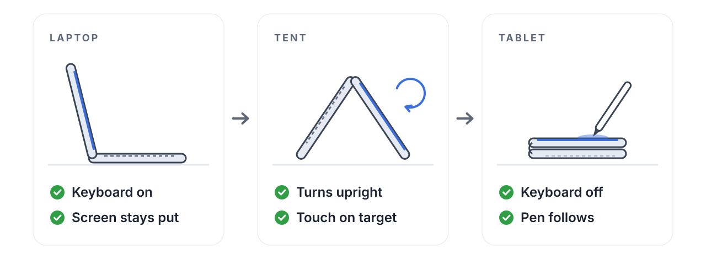
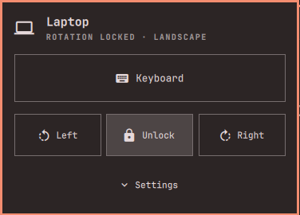

<p align="center">
  
</p>

<h1 align="center">Tablet Mode for Omarchy</h1>

<p align="center">
  <b>Fold your 360° laptop into a tablet. Everything else follows.</b><br>
  Auto-rotation, touch and pen that keep up, a keyboard that goes quiet.
</p>

<p align="center">
  <a href="https://github.com/andreiyurik/omarchy-tablet-mode/actions/workflows/tests.yml"></a>
  
  
  
</p>

<picture>
  <source media="(prefers-color-scheme: dark)" srcset="assets/hero-dark.svg">
  
</picture>

## The problem

[Omarchy](https://omarchy.org/) looks stunning on a convertible — right up
until you fold it.

- **The screen stays sideways**, however you hold it.
- **Taps and pen strokes miss**, landing off to the side of your finger.
- **The keyboard keeps typing.** Folded face down on the table, its keys press
  themselves into whatever window is open.

**Tablet Mode fixes all three, with nothing to configure.** Fold the laptop and
it becomes a tablet. Open it and it is a laptop again.

## Install

```bash
omarchy plugin add https://github.com/andreiyurik/omarchy-tablet-mode --enable
```

That's it — fold your laptop.

Turning the screen with the machine takes one package from the Arch
repositories, **iio-sensor-proxy**, which reads the accelerometer. Add it from
the Omarchy menu under *Install › Package*. Until it is there, the panel says
so, and everything else already works.

The plugin writes nothing into `~/.config/hypr`. It changes the running
compositor only, and puts its changes back after every config reload.

## What you get

| When you… | Without Tablet Mode | With Tablet Mode |
|---|---|---|
| Fold the screen back | Keys press against the table | Keyboard and touchpad switch off |
| Hold it upright | The picture stays sideways | The screen turns with you |
| Touch or draw | Taps land off to the side | Touch and pen follow the screen |
| Work with it on your knees | — | Nothing flips until you fold it |
| Read in bed | The screen spins as you shift | Lock it from the bar |
| Need to type while folded | No keys to reach | An on-screen keyboard comes up |
| Plug in a monitor | The pen spreads across both screens | The pen stays on the laptop's panel |

## Why it feels native

- **Zero setup.** It finds your panel, touchscreen, pen, built-in keyboard and
  fold sensor on its own — and leaves your USB keyboard alone.
- **Rotates like a tablet, not a phone.** Only once folded, so a laptop on your
  knees never flips. A machine that never reports its fold still turns.
- **Instant.** The screen turns live, without reloading your config.
- **Made for fingers.** A button in the bar opens a panel of big targets: the
  keyboard, and the rotation lock.
- **At home in Omarchy.** Your touchpad toggle, clamshell mode, external
  monitors and hyprmoncfg keep working as before.
- **Built for real life.** Suspend while folded, config reloads and a sensor
  that hiccups are all handled — and tested on real hardware.
- **Leaves no mess.** No root, no system services, no edits to your config
  files. Disable or remove it, and your laptop is simply a laptop again.

## Will it work on my laptop?

If it folds back 360°, very likely. A machine needs two things the kernel
reports on its own: an **accelerometer** that iio-sensor-proxy can read, and a
**tablet mode switch** (`SW_TABLET_MODE`) that fires when the screen folds back.
Nearly every convertible from the last several years has both. You also need
Omarchy with its Hyprland Lua config (`~/.config/hypr/hyprland.lua`).

A regular clamshell laptop has nothing to rotate, so this plugin is not for it.
A machine without an accelerometer still gets the rotation lock and turning the
screen by hand. One whose fold goes unreported still turns with the sensor, in
every position, since the plugin cannot tell laptop from tablet there.

| Family | Fold sensor | Status |
|---|---|---|
| Lenovo ThinkPad X1 Yoga Gen 6 | `thinkpad_acpi` | **Tested**: rotation, fold, touch and pen, suspend while folded |
| Other ThinkPad Yoga (X1 Yoga, X13 Yoga, L13 Yoga) | `thinkpad_acpi` | Expected to work |
| Lenovo Yoga 2-in-1 | `lenovo-ymc` or `intel-vbtn` | Expected to work |
| HP Spectre x360, Envy x360, EliteBook x360 | `hp-wmi` or `intel-vbtn` | Expected to work |
| Dell XPS 13 2-in-1, Latitude and Inspiron 2-in-1 | `intel-vbtn` | Expected to work |
| ASUS Zenbook Flip, Vivobook Flip | `asus-nb-wmi` | Expected to work |
| Microsoft Surface and other detachables | varies, often needs the linux-surface kernel | Untested |
| Dual-screen laptops (Yoga Book 9i and the like) | — | Not supported: one internal panel only |

"Expected to work" means the machine reports what the plugin reads, not that
anyone has tried it yet. Both ways the fold can arrive have been seen working
on the X1 Yoga: the sysfs state ThinkPad, ASUS and HP machines offer, and the
Hyprland switch events every other vendor relies on. What is left to learn per
model is whether its tablet mode switch is reported at all, and whether its
accelerometer is mounted as it should be — see
[If the screen rotates the wrong way](#if-the-screen-rotates-the-wrong-way).

### Checking your machine in a minute

```bash
monitor-sensor --accel
```

Turn the machine on its side: a line saying the accelerometer orientation
changed means the sensor works. Then, with the plugin installed:

```bash
~/.config/omarchy/plugins/andreiyurik.tablet-mode/bin/omarchy-tablet-mode detect
```

`tablet_switch` or `tablet_sysfs` should name something, `touch` should list
your touchscreen and pen, `internal` only the built-in keyboard and pointers,
and `sensor_proxy` should be `true`. If any of that is wrong, or your machine
works and is not in the table, please file a
[machine report](https://github.com/andreiyurik/omarchy-tablet-mode/issues/new?template=machine-report.yml)
— it asks for that output and a few ticks, and takes two minutes.

## The panel



The rotation icon sits in the bar. A tap opens the panel, which says what the
machine and the screen are doing and holds the two things a folded machine is
reached for:

- **Keyboard.** Shows or hides the on-screen keyboard. See
  [Typing while folded](#typing-while-folded).
- **Left, Lock, Right.** Lock freezes the orientation, the way a tablet's
  rotation lock does. Turning the screen by hand locks it too, so the sensor
  does not turn it straight back. Turning it back to landscape lets go, and so
  does opening the machine into a laptop or logging out.

**Settings**, at the bottom, opens what is set once, if ever:

- **Keyboard when folded.** Whether folding brings up the on-screen keyboard.
- **Screen turns the wrong way?** The accelerometer mounting; see below.

With a mouse, a middle click on the icon turns the screen without opening
anything.

<br clear="right">

### If the screen rotates the wrong way

The sensor reports which way is up, but not how it was screwed into the
chassis. `Standard` is right for every machine tried so far, the ThinkPad X1
Yoga Gen 6 included. If yours comes out wrong, turn the machine, see which
positions come out mirrored, and pick the matching entry under the panel's
**Settings**:

| Symptom | Choice |
|---|---|
| Only the two upright positions are mirrored | `Upright ⇄` |
| Only the two flat positions are mirrored | `Flat ⇄` |
| Everything is upside down | `180°` |

That setting is a workaround. The lasting fix belongs in systemd: its
[`60-sensor.hwdb`](https://github.com/systemd/systemd/blob/main/hwdb.d/60-sensor.hwdb)
carries an `ACCEL_MOUNT_MATRIX` per model, and iio-sensor-proxy applies it for
every desktop, not just this one. A machine that needs anything other than
`Standard` here is a machine missing from that file; `monitor-sensor`, which
ships with iio-sensor-proxy, shows what the sensor reports while you try a
matrix. Please also file a
[machine report](https://github.com/andreiyurik/omarchy-tablet-mode/issues/new?template=machine-report.yml),
so the next person with your model knows what to pick.

## The pen

If your machine has a pen, it needs nothing of its own: the plugin binds the
built-in touchscreen and pen to the laptop's panel and turns them with it, so
with an external display connected the pen still lands under the tip. Anything
else about the pen is Hyprland's to configure, in its `input.tablet` and
`cursor` options (`cursor:hide_on_tablet` hides the pointer while you write).

## Typing while folded

Folded, the built-in keyboard is off and faces the table. Tablet Mode does not
draw a keyboard of its own; it works with the on-screen keyboards already in
the [Omarchy plugin directory](https://plugins.omarchy.org/). Enable one, and
folding the machine brings it up on the laptop's panel, while opening it puts
the keyboard away again — only if folding is what brought it up, so a keyboard
you opened yourself stays.

| Keyboard | Plugin id | Status |
|---|---|---|
| [On-Screen Keyboard](https://github.com/abdxdev/omarchy-onscreen-keyboard) by abdxdev | `io.github.abdxdev.onscreen-keyboard` | **Tested**: comes up on the panel and goes away |
| [Omaqwerty](https://github.com/frostmute/omarchy-omaqwerty) | `io.github.frostmute.tablet-keyboard` | Expected to work: opened the same way |
| [On-Screen Keyboard](https://github.com/mtolhuys/omarchy-onscreen-keyboard) by mtolhuys | `io.github.mtolhuys.onscreen-keyboard` | Expected to work: through its documented `omarchy-shell onscreen-keyboard` commands |

With more than one enabled, the first in this table is used. **Keyboard when
folded**, under the panel's **Settings**, turns the behavior off. The panel's
**Keyboard** button shows or hides it by hand, as does:

```bash
~/.config/omarchy/plugins/andreiyurik.tablet-mode/bin/omarchy-tablet-mode keyboard toggle
```

## A keybinding, if you want one

The plugin does not claim a key. To add some, in `~/.config/hypr/bindings.lua`:

```lua
local tablet = os.getenv("HOME") .. "/.config/omarchy/plugins/andreiyurik.tablet-mode"
o.bind("SUPER + ALT + O", "Rotate screen", tablet .. "/bin/omarchy-tablet-mode rotate next")
o.bind("SUPER + ALT + SHIFT + O", "Tablet Mode panel", "omarchy-shell andreiyurik.tablet-mode toggle")
```

`SUPER + CTRL + O` is Omarchy's "Toggle menu", so pick something else.

## Command line

The CLI lives inside the plugin and is not on your `PATH`:

```bash
cli=~/.config/omarchy/plugins/andreiyurik.tablet-mode/bin/omarchy-tablet-mode

$cli rotate normal|right|inverted|left|next|prev
$cli lock on|off|toggle
$cli keyboard show|hide|toggle   # the on-screen keyboard plugin, if one is enabled
$cli status      # JSON, what the panel reads
$cli detect      # what it found on your machine — include this in issues
```

## Limitations

**A rotated panel's monitor rule replaces the one in `monitors.lua`.** Mode,
position and scale are carried over, but anything else set on that output
(such as VRR) is not, while the panel is turned.

**A config reload straightens a turned screen for a moment.** Reloading
rebuilds the monitor rules from your files, and the plugin turns the panel back
as soon as the reload finishes.

**A machine that locks while folded has to be opened to type the password.**
The built-in keyboard is off in tablet position, Omarchy's lock screen has no
on-screen keyboard, and Wayland shows nothing of another program's above a
locked session, so no keyboard plugin can help there. Opening the lid switches
the keyboard back on at once; a fingerprint reader works folded too.

**The fold is heard while the shell runs.** The switch binds belong to the
running session, so if Omarchy's shell is not running, folding does not switch
the keyboard off.

**A window that ignores resize requests stays the size it was.** Nothing here
can help a hung application; it will sit at its old geometry until it responds.

## How it works, and why it works that way

**Everything is applied at runtime, with `hyprctl eval`.** On a Lua config
Hyprland refuses `hyprctl keyword`, but `eval` changes the running compositor
directly — the same way Omarchy's own monitor scaling does. The screen turns
without a config reload, and nothing is written into `~/.config/hypr`.

**A reload is followed, not fought.** A reload rebuilds monitor rules and binds
from the files: the panel straightens while the touchscreen stays turned, and
the switch binds are gone. The
daemon listens on Hyprland's event socket and, the moment a reload finishes,
puts all of it back. Because it comes after every file, this also wins over
tools whose monitor rules load late, such as hyprmoncfg. The orientation last
applied on purpose is kept in `~/.local/state/omarchy/tablet-mode/`.

**Settings are read from `shell.json`.** Omarchy stores a widget's settings on
its entry there, and the daemon reads them from that entry and follows the file,
so a change applies at once and does not depend on the panel and its service
being loaded together.

**The fold comes from Hyprland's switch events.** Hyprland receives
`SW_TABLET_MODE` from libinput, which works on every vendor that reports it
(`intel-vbtn`, `intel-hid`, `thinkpad_acpi`, `asus-nb-wmi`, `hp-wmi`, …) and
needs no permissions. The daemon binds `switch:on` and `switch:off` for the
device that has that switch, and the CLI switches input off or on at once. On
ThinkPad, ASUS and HP machines the current state is also readable from sysfs,
and there it wins: an event only says what changed.

Every tablet mode switch is bound, not just one — a ThinkPad has two. Some
drivers, `intel-hid` among them, register their switch only on the first fold,
so the plugin binds their names ahead of time. Otherwise the first fold after
boot would go unheard, and on many Dell, HP and Lenovo machines that switch is
the only fold sensor there is. Until that first fold, such a machine is one
whose fold is unknown, and the screen follows the sensor.

**Built-in devices are told apart by udev, not by name.** udev tags every input
device `ID_INTEGRATION=internal` or `external`, which is what keeps a USB
keyboard live in tent mode and a drawing tablet on the desk from turning with
the panel. The power button and hotkeys are keys but not a keyboard, so they
keep working while folded.

**The touchscreen needs its own transform.** Binding a digitizer to an output
maps its coordinates into that monitor's area but does *not* rotate its axes.
Without a matching device transform, taps land in the wrong place and a swipe
scrolls sideways.

**Omarchy's toggles are respected.** A touchpad Omarchy's own toggle has
switched off stays off when the machine unfolds, and a panel Omarchy has turned
off, lid shut with a display attached, is never turned or woken.

**The daemon reports; the panel does not poll.** It prints its state as a line
of JSON whenever something changes, and reacts to the lock and to switch events
through file notifications. A sysfs fold sensor, which raises no events, is the
only thing read on a timer.

**Disabled means inert.** When the daemon is stopped because the plugin was
disabled or removed, it turns the panel upright, gives the keyboard back and
takes its switch binds down.

## Development

```bash
tests/run
```

The suite works in a temporary `HOME` with `hyprctl` stubbed out, so it never
touches the running compositor or your config.

The icon, the illustrations and `preview.png` are drawn by `assets/make-art`;
change the words or colors there and run it again. `assets/panel.png` is a
screenshot of the panel.

## Uninstall

```bash
omarchy plugin remove andreiyurik.tablet-mode
```

Nothing else is left to clean up: the plugin keeps no files outside its own
folder but its state in `~/.local/state/omarchy/tablet-mode/`.

## License

MIT
